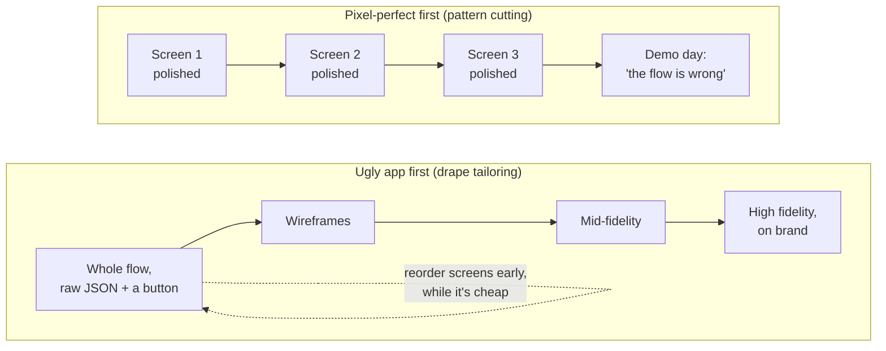

Notes on [Software Engineering Daily: Building Software That People Love](https://softwareengineeringdaily.com/podcasts/building-software-that-that-people-love/), with [Wesley Yu](https://x.com/wesleycyu) (VP of Engineering at [Metalab](https://www.metalab.com/)) talking to [Josh Goldberg](https://www.joshuakgoldberg.com/).

## The 30-Second Reality Check

Metalab has done work for Slack, Uber and Instacart, and their recipe for delight is pretty dull. Boring stacks, ugly first versions, useful features before fun ones. A lot of the job is talking clients out of the shiny bits.

## Explain With Pictures

Same end product. One team finds out the flow is wrong in week 2; the other finds out at the launch party.

## 3 Hot Takes & Quotes

**1. Your stack is a hiring plan wearing a technical costume.**

> I think the longer that you work in agency, the faster you settle into choosing the most boring, stable technologies for your clients.

> a stack decision is not just a technical exercise. It's also a hiring plan and an onboarding plan. And what does it mean to support this thing at 2am in the morning?

Metalab's tech decision tree starts with "what can the client maintain and hire for in their city", not "what's trending on Hacker News". Yu is refreshingly honest about the old days, when choices were "driven by what we wanted to learn, what we wanted to try in production." Every team does résumé-driven development at some point. The grown-up move is noticing who gets paged at 2am for it. (If you must try the shiny thing, Metalab's trick is to put it in an isolated sidecar you can rip out later.)

**2. Perfectionism is just waterfall with better fonts.**

> I think a really great skill is being okay delivering an ugly app.

The ugly app is the whole flow, start to finish, where some screens "just render JSON and a button". Clients get confused by the "squiggly brackets" in sprint demos. Then they start reordering screens, and suddenly the product is better before anyone has picked a font. Polishing screen one before screen five exists feels careful, but you're betting the whole flow is right and you haven't checked.

**3. Building on the AI frontier means building things to throw away.**

> building on the frontier is really hard and risky. You spend a lot of time building bespoke things that you end up needing to throw away because the industry standardizes around some sort of tooling.

Metalab built its own LLM eval tooling, and custom MCP servers for Notion and Figma. Then the vendors shipped their own, which were better, and the custom ones went in the bin. Your homegrown AI tooling has a half-life of one vendor announcement. Yu's job now includes deciding "what should we just wait for the industry to figure out for us?" and honestly I think that's the most underrated engineering strategy going right now.

## The Post-Mortem / Verdict

Funny thing about an episode on delight, almost none of it is about the delightful part. Most of it is the boring stack, the ugly drafts, the warm hand-off to whoever maintains it next, and the review that catches a designer's AI-generated PR before production. This from a studio that admits "we sometimes have to argue for the functional thing over the delightful thing." Yu's own analogy from his days performing kids' magic shows nails it:

> The magic to me is all the effort behind this tiny interaction, this tiny moment of delight.

Delight is the trick. The ugly JSON screens are the hours of practice nobody sees. Skip those, and your "magic" is just a Slackbot GIF bolted onto a broken flow.

## Links & References

- **The episode:** [Building Software That People Love](https://softwareengineeringdaily.com/podcasts/building-software-that-that-people-love/), Software Engineering Daily, 30 Jun 2026 ([transcript](https://softwareengineeringdaily.com/wp-content/uploads/2026/07/SED1930-Metalab.txt))
- **Wesley Yu** (guest), VP of Engineering at Metalab: [X](https://x.com/wesleycyu)
- **Josh Goldberg** (host), typescript-eslint maintainer: [Website](https://www.joshuakgoldberg.com/) · [Bluesky](https://bsky.app/profile/joshuakgoldberg.com) · [Fosstodon](https://fosstodon.org/@JoshuaKGoldberg) · [GitHub](https://github.com/JoshuaKGoldberg)
- [Metalab](https://www.metalab.com/), the design and engineering studio discussed in the episode
