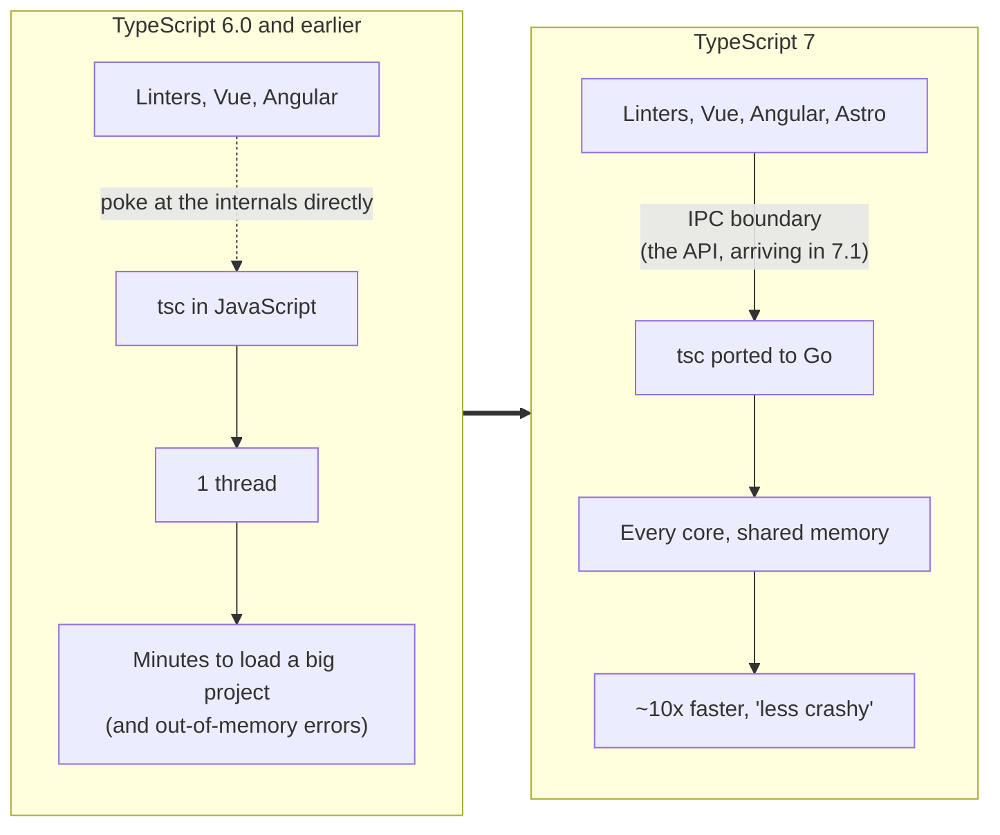

Notes on [Software Engineering Daily: TypeScript 7 and What Comes Next](https://softwareengineeringdaily.com/podcasts/typescript-7-and-what-comes-next/), with [Daniel Rosenwasser](https://github.com/DanielRosenwasser) (TypeScript PM at Microsoft) talking to [Josh Goldberg](https://www.joshuakgoldberg.com/) (typescript-eslint).

## The 30-Second Reality Check

TypeScript 7 is the compiler ported line by line from TypeScript to Go, and it's "often a 10X speed up". But if you lean on the compiler API (Vue, Angular, Astro, editor plugins), you're mostly waiting for 7.1.

## Explain With Pictures

Same compiler logic, new language, and one new wall: tools no longer share the compiler's memory. They now have to ask for data across a process boundary.

## 3 Hot Takes & Quotes

**1. The best rewrite is the one you refuse to call a rewrite.**

> We've been describing this more as a port, because we've been looking basically on the left side of the screen, right side of the screen. One side is TypeScript. The other side is the Go that we're converting to.

Every engineer who has pitched a "quick rewrite" and come back 18 months later with half the features should frame this. The TypeScript team didn't redesign anything. They transliterated, file by file, and got the speed from Go and from parallelism. No cleverness required. Meanwhile your "we'll fix the architecture while we're in there" plan is exactly how the 18 months happen.

**2. JavaScript tooling is now written in everything except JavaScript.**

> The up and coming very fast, very integrated Linter, OXlint, is built on Rust, but its TypeScript integration is this thing called tsgolint (Josh Goldberg)

So a Rust linter calls a Go type checker to check TypeScript, with custom rules written in TypeScript. Three languages to lint one. The JS ecosystem's big performance breakthrough was quietly admitting that JS wasn't the right tool to build JS tools. Fine. Just stop pretending your `node_modules` is a monoculture.

**3. "Organic" API growth is a polite name for technical debt.**

> There's basically this API that grew very organically.

Translation: for a decade, tools reached into the compiler's guts because nothing stopped them. The Go port broke that, so the new API goes over IPC, where:

> You actually have to transfer things over and be a little bit more disciplined in how you ask for certain information across the wire

A process boundary is the only API review board nobody can bypass. The cost is that everyone who built on the old internals (Vue, Angular, Astro, every editor plugin) waits for 7.1. And on tools reaching in anyway: "It's open source. You can't really stop people."

## The Post-Mortem / Verdict

Credit where due: a 10x speedup that also ships fewer crashes is rare enough that the host said it out loud.

> it's not only better, it's less crashy. (Daniel Rosenwasser)
>
> What a rare treat to hear in this day and age of software. (Josh Goldberg)

The practical answer, straight from the source: if you're on TypeScript 6.0 with no editor plugins and no Vue or Angular, "it's very likely that you can just start running TypeScript 7 today." Everyone else gets to run 6 and 7 side by side and refresh the GitHub threads about the API.

As for the "let the LLM write your lint rules" future: maybe. But as Rosenwasser points out, every language feature still "starts at negative 1,000 points", and a robot that can write type gymnastics doesn't make them any easier for the next human to read.

For the record, this blog runs on Astro, so I'm in the 7.1 waiting room too. At least the waiting room loads fast now.

## Links & References

- **The episode:** [TypeScript 7 and What Comes Next](https://softwareengineeringdaily.com/podcasts/typescript-7-and-what-comes-next/), Software Engineering Daily, 27 Aug 2026 ([transcript](https://softwareengineeringdaily.com/wp-content/uploads/2026/08/SED1956-Daniel-Rosenwasser.txt))
- **Daniel Rosenwasser** (guest), Principal Product Manager of TypeScript at Microsoft: [GitHub](https://github.com/DanielRosenwasser) · [Bluesky](https://bsky.app/profile/danr.bsky.social) · [X](https://x.com/drosenwasser)
- **Josh Goldberg** (host), typescript-eslint maintainer: [Website](https://www.joshuakgoldberg.com/) · [Bluesky](https://bsky.app/profile/joshuakgoldberg.com) · [Fosstodon](https://fosstodon.org/@JoshuaKGoldberg) · [GitHub](https://github.com/JoshuaKGoldberg)
- [Announcing TypeScript 7.0](https://devblogs.microsoft.com/typescript/announcing-typescript-7-0/), the official release post
- [microsoft/typescript-go](https://github.com/microsoft/typescript-go), the Go port's repository
- [typescript-eslint](https://typescript-eslint.io/)
- [Oxlint](https://oxc.rs/docs/guide/usage/linter.html) and [tsgolint](https://github.com/oxc-project/tsgolint)
