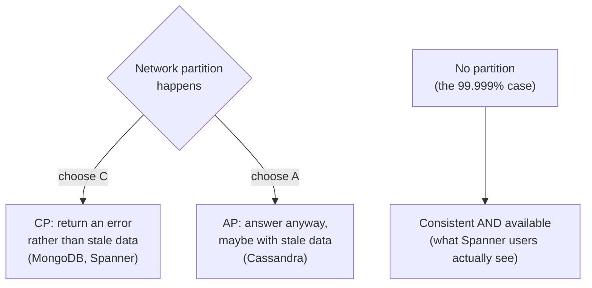

_Originally published in September 2019. Rewritten in October 2026, with more sarcasm and fewer exclamation marks._

This started with a podcast episode with [Deepti Srivastava](https://x.com/TheDeepti) on [Google Spanner](https://cloud.google.com/spanner):

<blockquote class="twitter-tweet">
Google Spanner with Deepti Srivastava <a href="https://twitter.com/TheDeepti?ref_src=twsrc%5Etfw">@TheDeepti</a> <a href="https://twitter.com/googlecloud?ref_src=twsrc%5Etfw">@GoogleCloud</a> <a href="https://twitter.com/GCPcloud?ref_src=twsrc%5Etfw">@GCPcloud</a> <a href="https://twitter.com/googledevs?ref_src=twsrc%5Etfw">@googledevs</a> <a href="https://t.co/ygoBhUTJ0z">https://t.co/ygoBhUTJ0z</a> <a href="https://t.co/6TjPfsLrOO">pic.twitter.com/6TjPfsLrOO</a>
&mdash; Software Daily (@software_daily) <a href="https://twitter.com/software_daily/status/1171348845323849728?ref_src=twsrc%5Etfw">September 10, 2019</a></blockquote> 

## The 30-Second Reality Check

The [CAP theorem](https://en.wikipedia.org/wiki/CAP_theorem) says that when the network splits, a database picks consistency or availability. Spanner still picks consistency. Google's private network just fails so rarely that it looks like you get both.

## Explain With Pictures

The clever part has little to do with the algorithm. Google made the partition box so rare that hardly anyone gets to see which way Spanner goes.

## 3 Hot Takes & Quotes

**1. The man who coined CAP says Spanner doesn't break it.**

> The purist answer is "no" because partitions can happen and in fact have happened at Google, and during some partitions, Spanner chooses C and forfeits A. It is technically a CP system. (Eric Brewer, 2017)

When the person whose name is on the theorem writes a blog post explaining your marketing, the marketing was doing some heavy lifting. "Breaks CAP" really means "we're CP, and we're very good at networks".

**2. The real innovation is owning the network.**

> In practice, we find that Spanner does meet this bar, with more than five 9s of availability (less than one failure in 10⁵). (Eric Brewer, 2017)

Spanner's secret sauce is Google's private, redundant global network, plus synchronized clocks (TrueTime) so nodes can agree on the order of events. You can't `npm install` a private fibre network. "Just do what Google does" is cheap advice when the first step is "own the planet's backbone".

**3. Your single-server database was never in this fight.**

> Basic deployments of RDBMS are, usually, CA. So, they're not actually distributed systems (me, 2019)

A primary database with read replicas isn't beating CAP either. It's skipping the question until the day the network splits, the replicas elect a new primary, and you get two databases that each think they're in charge. You can call that CA if you like. I'd call it an incident on a timer.

## The Post-Mortem / Verdict

Spanner is a great database and an even better marketing case study. CAP still holds. Google just made partitions so rare that, in practice, users can treat it as CA. Brewer's own summary: "no" technically, but "yes" in effect. If you don't own a planet-scale private network, pick C or A deliberately, before a partition picks for you.

## Links & References

- [Google Spanner with Deepti Srivastava](https://twitter.com/software_daily/status/1171348845323849728), Software Engineering Daily, September 2019; [Deepti Srivastava on X](https://x.com/TheDeepti)
- [Spanner: TrueTime and the CAP Theorem](https://research.google/pubs/spanner-truetime-and-the-cap-theorem/), Eric Brewer, Google Research
- [Inside Cloud Spanner and the CAP Theorem](https://cloud.google.com/blog/products/databases/inside-cloud-spanner-and-the-cap-theorem), Eric Brewer, Google Cloud blog, February 2017
- [Google Cloud Spanner](https://cloud.google.com/spanner) and its [whitepapers](https://cloud.google.com/spanner/docs/whitepapers)
- [CAP theorem](https://en.wikipedia.org/wiki/CAP_theorem) on Wikipedia
