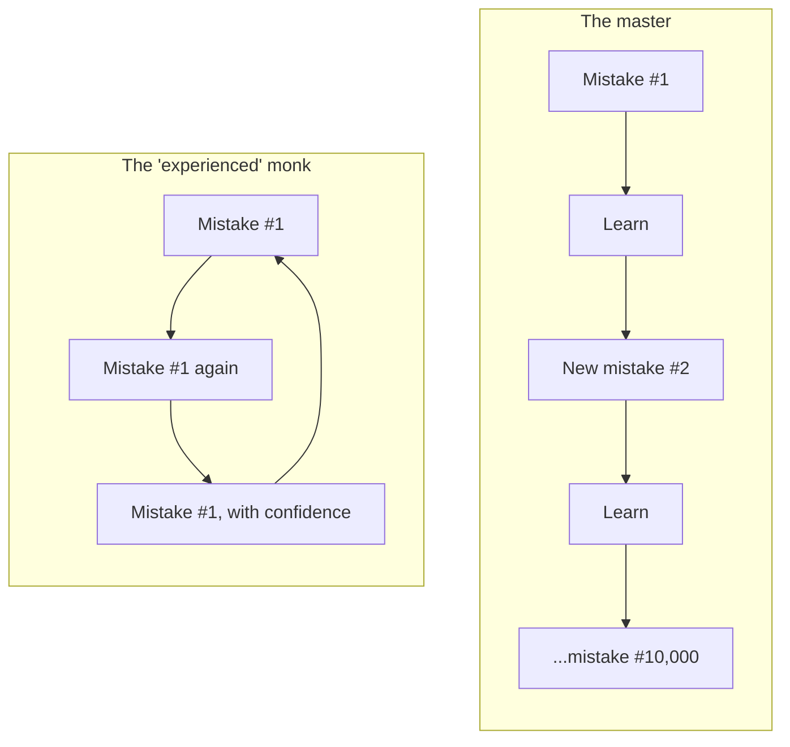

_Originally published in May 2019. Rewritten in October 2026, with more sarcasm and fewer exclamation marks._

## The 30-Second Reality Check

People ask me who's better, the engineer who stayed put for years or the one who hopped jobs. Neither, really. I care how many _different_ mistakes you've made, and a koan from [The Codeless Code](https://thecodelesscode.com/case/100) agrees.

## Explain With Pictures

Same number of years on both résumés. Very different engineers.

## 3 Hot Takes & Quotes

**1. Years of experience is a vanity metric.**

> Banzen shook his head sadly. "Ten mistakes, a thousand times each."

That's the engineer with "15 years of experience" who has really had one year of experience fifteen times. The job title says senior. The incident history says the same three outages, rebranded annually.

**2. Avoiding mistakes is the worst mistake.**

> The novice, not understanding, sought to avoid all error. An abbot observed and brought the novice to Banzen for correction.

Teams that punish failure end up with the same number of mistakes, just _hidden_ ones, plus engineers who never touch anything risky. That's why blameless post-mortems exist: the abbot was running one before it was cool.

**3. Even the gods ship bugs.**

> Banzen explained: "I have made ten thousand mistakes; Suku has made ten thousand mistakes; the patriarchs of Open Source have each made ten thousand mistakes."

Every maintainer you admire has a commit history full of reverts. Look up any famous project's "fix the fix" commits. Mastery looks like a long record. A spotless one is a bit suspicious.

## The Post-Mortem / Verdict

Monk vs master was never about tenure versus job-hopping. A lifer can rack up ten thousand distinct mistakes; a hopper can repeat the same ten at every company. In interviews, stop asking "how many years?" and start asking "what's the most interesting thing you broke, and what did you change afterwards?"

## Links & References

- [The Codeless Code, Case 100](https://thecodelesscode.com/case/100), the source of every quote in this post
