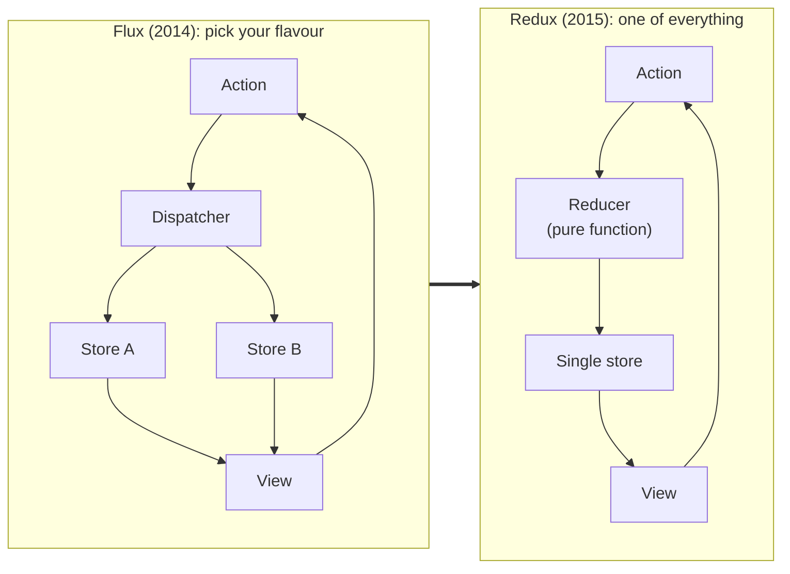

_Originally published in June 2019. Rewritten in October 2026, with more sarcasm and fewer exclamation marks._

## The 30-Second Reality Check

[Flux](https://web.archive.org/web/20190406233000/https://facebook.github.io/flux/docs/overview.html) was a pattern, so everyone shipped their own library of it. [Redux](https://redux.js.org/) won those "Flux Wars" by being tiny, predictable and boring. Then React added [Context](https://legacy.reactjs.org/docs/context.html), [Apollo Client](https://www.apollographql.com/docs/react/) showed up, and the internet started holding Redux funerals. Redux has attended every one of them.

## Explain With Pictures

Redux removed the dispatcher, merged the stores into one and made state changes pure functions. Less to argue about, so the arguing stopped.

## 3 Hot Takes & Quotes

**1. Boring won the war. It always does.**

> Redux won the war around 2015-2016 due to its simplicity and leadership of Dan Abramov and there was peace. Long live the King!! — me, 2019

Redux's whole idea fits on a napkin: state is a value, actions describe changes, a pure function applies them. [Dan Abramov's free Egghead course](https://egghead.io/courses/fundamentals-of-redux-course-from-dan-abramov-bd5cc867) taught it in bite-sized videos. Every competing Flux library had more features. That was the problem.

**2. "Redux is dead" is a genre, not a fact.**

> Since Redux had gained so much dominance it was an easy target for people to say it was finished. — me, 2019

Being declared dead is what happens to anything popular enough to be boring. Meanwhile, huge production apps quietly keep running on it, because rewriting your state layer to follow a Twitter thread is not a business plan.

**3. Most apps never needed it in the first place.**

> Redux is a bit overkill for simple data management and UI needs which is the requirement for most of the projects. — me, 2019

The real crime was never Redux. It was wiring a global store, actions, reducers and middleware into a to-do app because a tutorial said "this is how React is done". Architecture should arrive when the pain does, not before.

## The Post-Mortem / Verdict

> Today's pattern will be different tomorrow. — me, 2019

Still the best line I wrote in that post. My jQuery components from the AJAX era were cutting edge too. Build something people care about; they won't ask which state library you used. If you succeed, you can refactor later. If you don't, the state library was never the problem.

## Links & References

- [React](https://react.dev/) and the [React Context docs](https://legacy.reactjs.org/docs/context.html) (legacy docs)
- [Flux overview](https://web.archive.org/web/20190406233000/https://facebook.github.io/flux/docs/overview.html) (archived copy) and the [archived Flux repository](https://github.com/facebookarchive/flux)
- [Redux](https://redux.js.org/)
- [Fundamentals of Redux Course from Dan Abramov](https://egghead.io/courses/fundamentals-of-redux-course-from-dan-abramov-bd5cc867) on Egghead
- [Apollo Client for React](https://www.apollographql.com/docs/react/)
